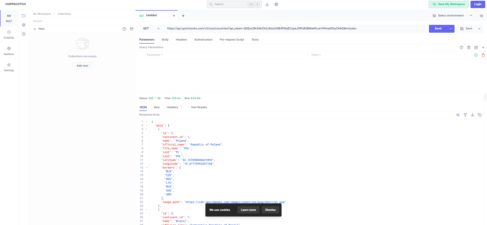
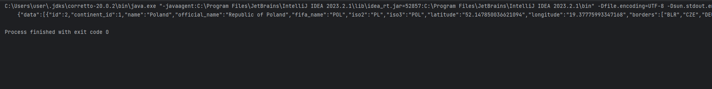

# week3group

__Problem domain: Sports betting / Sports statistics (Football (Soccer))__
__Description:__
A website which displays statistics a user requests about certain players or teams in the sport soccer.
The website will have a home page with sections for any features we decide to implement to the application.
We will pull data from one or multiple APIs depending on how limited the APIs are in terms of the data we want.

__API documention:__ (Possible ones)
https://developer.sportradar.com/docs/read/Home 
https://app.sportdataapi.com/documentation

https://docs.sportmonks.com/football/welcome/getting-started (*)
- Token: QitEucGKAXbCkSJAboUWB4FMyECopeJ5iPoR3BMaHfxuIrVPkhab5hyCKIkD

- Example Java Code Output:

Technical Issues: SportMonkey API is not really "free" to use, so will have to switch to a new API.
